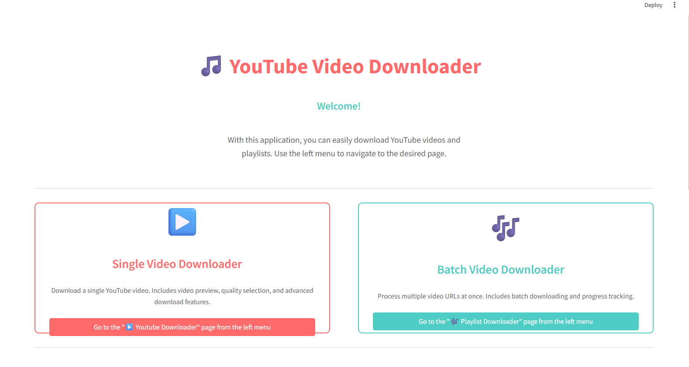
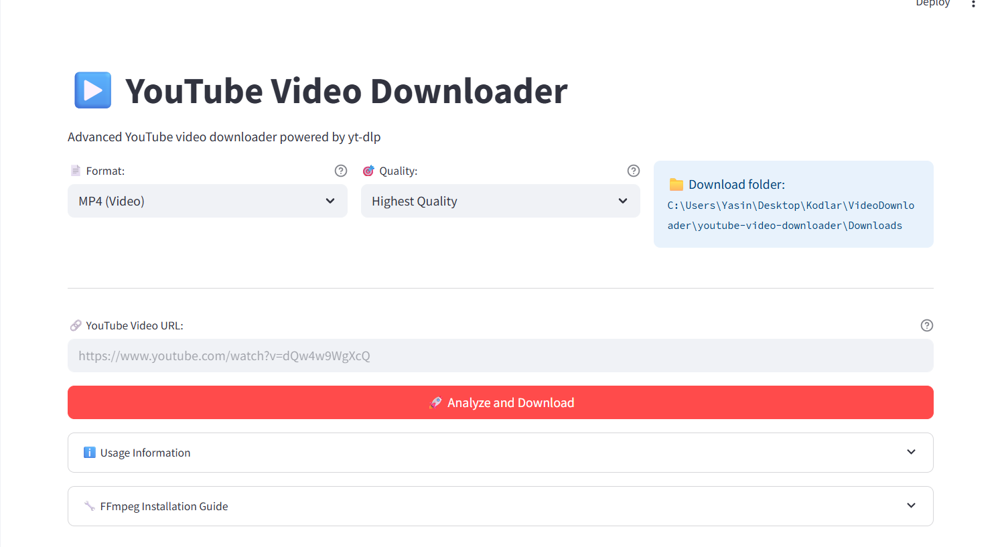
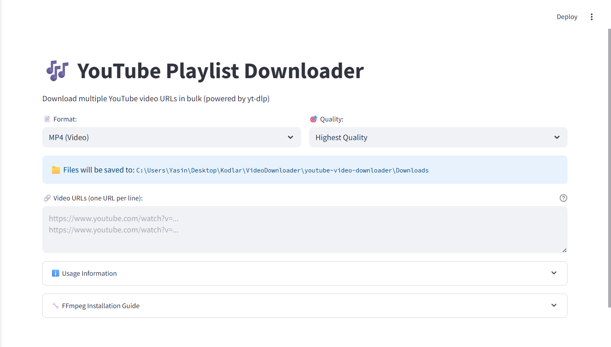

# YouTube Video Downloader 🎵

This is a **Streamlit-based application** that allows users to download YouTube videos and playlists in various formats and qualities.

## Features
- **Single Video Downloader:** Download individual YouTube videos.
- **Playlist Downloader:** Download entire YouTube playlists.
- **Format Options:** Download videos in MP4 format or extract audio as MP3.
- **Quality Selection:** Choose video quality (e.g., 720p, 480p, etc.).
- **User-Friendly Interface:** Simple and intuitive UI built with Streamlit.

## Installation

1. Clone the repository:
   ```bash
   git clone https://github.com/Pilestin/youtube-video-downloader.git
   cd youtube-video-downloader
   ```

2. Install the required dependencies:
   ```bash
   pip install -r requirements.txt
   ```

3. Run the application:
   ```bash
   streamlit run Home.py
   ```

## Usage

1. Open the application in your browser.
2. Choose between **Single Video Downloader** or **Playlist Downloader**.
3. Enter the YouTube URL(s) and select the desired format and quality.
4. Click the download button to start downloading.

## Requirements
- Python 3.7 or higher
- `yt-dlp` for downloading videos
- `streamlit` for the user interface

<!-- ## Application Features

### Video Downloading
- Download videos in MP4 format.
- Choose from multiple quality options (e.g., 720p, 480p, 360p).
- Preview video details such as title, duration, and thumbnail.
- Track download progress with a progress indicator.

### Audio Downloading
- Extract audio from videos in MP3 format.
- High-quality audio output (192 kbps).
- Requires FFmpeg for audio conversion.

### Advanced Features
- Reliable downloading powered by `yt-dlp`.
- Handles errors gracefully and provides detailed error messages.
- Automatically generates safe filenames for downloaded files.
- Supports batch downloading for multiple URLs.

### File Management
- Automatically saves files to the `Downloads` folder.
- Displays file size for downloaded files. -->

## FFmpeg Installation (Required for MP3 Conversion)
- **Windows:**
  ```bash
  choco install ffmpeg
  ```
- **Linux:**
  ```bash
  sudo apt install ffmpeg
  ```
- **macOS:**
  ```bash
  brew install ffmpeg
  ```

## Screenshots
### Home Page


### Single Video Downloader


### Playlist Downloader

